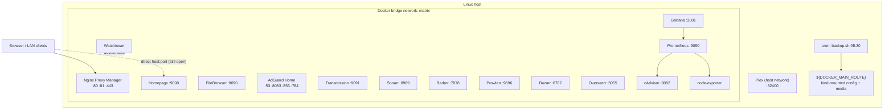
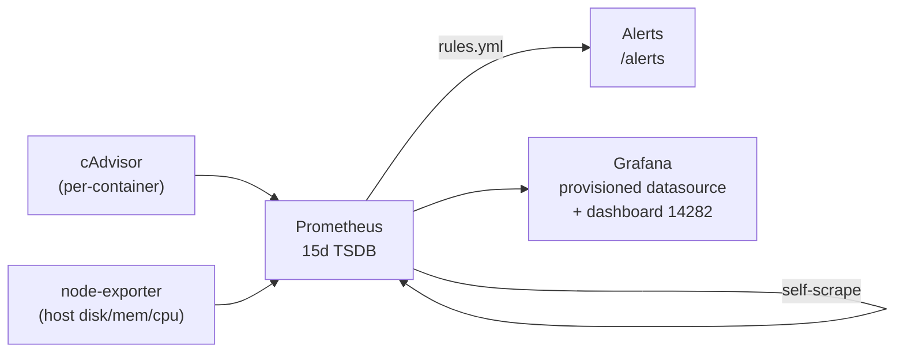

# Architecture

How Matrix is put together and why. For the click-by-click setup see the
[User guide](user-guide.md); for `.env` details see the
[Configuration reference](configuration.md).

## Context & goals

Matrix runs a personal media/home-server stack on **one Linux host** with Docker
Compose. The design optimizes for:

- **Reproducibility** — a blank host reaches a running stack with one script
  (`setup.sh`) and `docker compose up -d`. State lives outside the repo.
- **Low operational surface** — one operator, no orchestrator, no secrets
  manager. Backups, updates and observability are built in, not bolted on.
- **Reversibility** — changes (e.g. the reverse-proxy migration) are staged so a
  misconfiguration never locks the operator out.

Non-goals: high availability, multi-host scaling, multi-tenant isolation.

## The whole system at a glance



Everything except Plex lives on the `matrix` Docker bridge and reaches its peers
by container name (e.g. `http://sonarr:8989`). Plex uses host networking so it
can do GDM/DLNA client discovery, which a bridge can't pass.

## Services by role

| Role | Services |
| --- | --- |
| **Entry / dashboard** | Nginx Proxy Manager (reverse proxy), Homepage (dashboard) |
| **Network** | AdGuard Home (DNS + ad-block, DoH/DoT/DoQ) |
| **Media** | Plex (server), Overseerr (requests), Bazarr (subtitles) |
| **Automation** | Transmission (torrents), Sonarr (TV), Radarr (movies), Prowlarr (indexers) |
| **Files** | FileBrowser |
| **Operations** | Watchtower (auto-update) |
| **Observability** | cAdvisor + node-exporter → Prometheus → Grafana |

The authoritative list — images, ports, healthchecks, labels — is
[`compose.yml`](../compose.yml).

## Networking & the single entry point

Nginx Proxy Manager owns the host's `:80`/`:443`. The intended access path is

```
browser → *.matrix.lan (AdGuard DNS rewrite) → NPM :80 → service:port (bridge)
```

AdGuard resolves `*.matrix.lan` to the host; NPM terminates HTTP/TLS and proxies
to the container by name over the bridge. AdGuard's own admin UI moved off `:80`
to `:8083` so it doesn't collide with NPM.

**Transition state:** every service still publishes its direct `host:port` too.
That's deliberate — if the proxy is misconfigured you can still reach a service
directly. Locking the direct ports to `127.0.0.1` is an optional later hardening
step, not done yet. See [reverse proxy setup](user-guide.md#reverse-proxy-setup).

## Identity & permissions model

Containers must read/write bind-mounted host directories without leaving files
the operator can't manage. Three knobs in `.env`, all auto-detected by
`setup.sh`:

| Variable | What | Why not `UID`/`GID` |
| --- | --- | --- |
| `PUID` / `PGID` | User/group the LinuxServer containers run as | `UID`/`GID` are bash readonly built-ins; sourcing `.env` would fail, and `${UID}` under `sudo` resolves to **0** (root containers) |
| `DOCKER_GID` | Host `docker` group GID | Homepage runs as `PUID:PGID` (not root) but needs to read `/var/run/docker.sock` for discovery; it gets the docker group as a supplementary group |

`setup.sh` owns the data tree as the operator (`chmod u=rwX,g=rwX,o=`, no world
access) with two exceptions whose images run as fixed UIDs:

- **Grafana** → UID **472** (the `grafana` user in `grafana/grafana`).
- **Prometheus** → UID **65534** (`nobody` in `prom/prometheus`).

These are hardcoded in `setup.sh` and documented there; a major image bump is
the only thing that could change them.

FileBrowser is the deliberate exception: it runs as root and bind-mounts the
**entire** `${DOCKER_MAIN_ROUTE}` at `/srv`, so it can manage every service's
config. Acceptable for a single-operator box; it would be a finding on a shared
host.

## Configuration model

- **`.env` is the single source of truth** for paths and secrets. It is never
  committed (gitignored); `setup.sh` generates it from
  [`.env.example`](../.env.example) on first run with detected values + random
  secrets, mode `600`.
- **Service configs that live in the repo are repo-owned.** `prometheus.yml`,
  `prometheus/rules.yml` and `grafana/provisioning/**` are copied into the data
  tree by `setup.sh` on **every** run (overwrite). Edit them in the repo, pull,
  re-run `setup.sh`. Data directories (TSDB, grafana.db) are never touched.
- **No drift allowed.** CI's `env-drift` job fails if `compose.yml` references a
  `${VAR}` missing from `.env.example`.

## Image versioning & updates

A hybrid model (see [decision D1](#key-decisions)):

- **Four images are pinned** to exact tags — Plex, AdGuard, Prometheus, Grafana
  — because their upgrades benefit from a human look. They carry **no**
  Watchtower label.
- **Everything else stays on `:latest`** and carries
  `com.centurylinklabs.watchtower.enable=true`. Watchtower (opt-in mode, daily
  04:00) updates only the labelled containers.

Updating a pinned image is a manual tag bump — see
[Operations → Updating](operations.md#updating-images).

## Observability data flow



Prometheus scrapes itself, cAdvisor and node-exporter. Alert rules
(`prometheus/rules.yml`) fire on disk <15% free, memory <10% available, and
containers unseen for 5 min. They are **visible** in Prometheus `/alerts` and
Grafana but **not routed** anywhere — there is intentionally no Alertmanager
until a notification channel is chosen ([D6](#key-decisions)). Grafana's
datasource and the Docker/cAdvisor dashboard are provisioned as code, so first
launch is just a login.

## Backups

`backup.sh`, installed by `setup.sh` as a root cron job at **05:30** (after
Watchtower's 04:00 window), performs a cold backup: stop stack → `tar` the data
tree minus recoverable bulk (Plex media, Transmission downloads, Prometheus
TSDB) → snapshot `.env` beside the archive → restart → keep newest 14. Restore
is "untar + `setup.sh` + up". Full runbook: [Operations](operations.md#backup--restore).

## Bootstrap: what `setup.sh` does

Idempotent, auto-elevates with `sudo`, resolves the target user from
`$SUDO_USER`/`$MATRIX_USER`. Six phases:

1. Install OS utilities + Docker Engine + the compose plugin.
2. Add the user to `docker`; resolve `DOCKER_GID`.
3. Generate `.env` (detected `PUID`/`PGID`/`TZ`/paths + random secrets) if absent.
4. Create the directory tree; seed Filebrowser file-stubs; copy repo-owned
   Prometheus/Grafana configs.
5. Apply ownership/permissions (operator + the 472/65534 exceptions).
6. Install the nightly backup cron job.

A CI job (`setup-smoke`) runs the whole script in a clean `ubuntu:24.04`
container twice (proving idempotency) and asserts the resulting state.

## Repository layout

```
.
├── compose.yml                 # service definitions (source of truth)
├── .env.example                # template for the generated .env
├── setup.sh                    # one-shot host bootstrap
├── backup.sh                   # nightly cold backup (cron-installed)
├── prometheus/
│   ├── prometheus.yml          # scrape config (repo-owned)
│   └── rules.yml               # alert rules (repo-owned)
├── grafana/provisioning/       # datasource + dashboard (repo-owned)
├── scripts/check-env-drift.sh  # CI guard
├── .github/workflows/ci.yml    # shellcheck, compose-validate, env-drift, setup-smoke
└── docs/                       # this documentation
```

## Key decisions

These were settled during the tech-debt remediation; they explain "why it's
like this" so they aren't re-litigated.

| # | Decision | Rationale |
| --- | --- | --- |
| D1 | Pin only the 4 manual-review images; rest on `:latest` + Watchtower | Pinning everything would kill auto-update without a Renovate-style bot |
| D3/D4 | Backup = script + cron; exclude media/downloads/TSDB; snapshot `.env` | Trivial restore, no new deps; only irreplaceable state is archived |
| D5 | node-exporter on the bridge (`pid: host`) | Prometheus scrapes it by name; minor network-metric imprecision is acceptable |
| D6 | No Alertmanager | No notification channel chosen; unrouted alerts would be theatre |
| D7 | Prometheus/Grafana configs repo-owned (re-copied each run) | If config lives in the repo, the repo is the source of truth |
| D11 | NPM takes `:80`; AdGuard UI → `:8083`; direct ports stay open | Staged over big-bang so a proxy mistake can't lock you out |
| D12 | FileBrowser sees the whole tree as root | Explicitly accepted for a single-operator box |

(Original decision log lived in the planning doc; this is the durable subset.)
