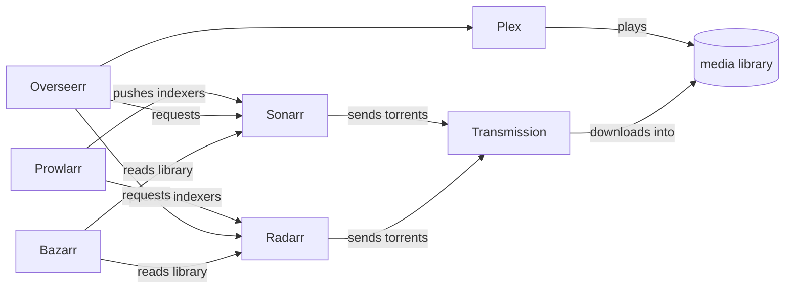

# User guide — first-run setup

`setup.sh` and `docker compose up -d` get every container *running*, but several
services need a one-time setup in their web UI, and they need to be wired to each
other. This guide is everything you have to do **by hand**, in a sensible order.

Replace `<host>` below with your server's LAN IP or hostname. The first time, use
direct ports; once you finish [Reverse proxy setup](#reverse-proxy-setup) you can
use the friendly `*.matrix.lan` names.

> **Where do credentials/keys go?** Anything this guide tells you to "note for
> later" goes into `.env` so Homepage's dashboard widgets light up. See
> [Homepage widgets](#homepage-widgets) at the end.

## Recommended order

1. [Plex](#1-plex) — claim the server, add libraries.
2. [AdGuard Home](#2-adguard-home) — finish the wizard.
3. [Transmission](#3-transmission) — confirm login.
4. [Prowlarr](#4-prowlarr) — add indexers, sync to the *arr apps.
5. [Sonarr & Radarr](#5-sonarr--radarr) — download client + root folders.
6. [Bazarr](#6-bazarr) — connect to Sonarr/Radarr for subtitles.
7. [Overseerr](#7-overseerr) — connect Plex + Sonarr + Radarr.
8. [Reverse proxy](#reverse-proxy-setup) — NPM + AdGuard DNS.
9. [Homepage widgets](#homepage-widgets) — paste the keys you collected.

How they connect:



---

## 1. Plex

`http://<host>:32400/web`

1. If you set `PLEX_CLAIM` before first start, the server is already tied to your
   account. If not, sign in here and claim it now.
2. Add libraries pointing at the in-container media paths:
   - **Movies** → `/media/movies`
   - **TV Shows** → `/media/series`
   - **Anime** (optional) → `/media/anime`
   - **Home videos** (optional) → `/media/homevideos`

These map to `${PLEX_MEDIA}/...` on the host. Sonarr/Radarr write into the same
tree, so new downloads appear in Plex automatically.

3. **`PLEX_TOKEN`** (for the Homepage widget): open any library item, ⋯ → Get
   Info → "View XML"; the URL contains `X-Plex-Token=...`. Copy that value.

## 2. AdGuard Home

First-run wizard: `http://<host>:3000`

1. Set the **admin web port to 80** (its container port; published on host
   `:8083`) and the **DNS port to 53** when the wizard asks.
2. Create the admin username/password.
3. Finish the wizard. From now on the admin UI lives at **`http://<host>:8083`**
   (host `:80` belongs to the reverse proxy).
4. Add blocklists under Filters → DNS blocklists (e.g. AdGuard DNS filter,
   OISD). Pi-hole config does **not** import — re-add lists here.
5. Point your router's DHCP DNS (or individual devices) at `<host>` to actually
   get ad-blocking.
6. Note the admin **username/password** → they become `ADGUARD_USERNAME` /
   `ADGUARD_PASSWORD` in `.env`.

## 3. Transmission

`http://<host>:9091`

Username/password were generated into `.env` (`TRANSMISSION_USER=admin`,
`TRANSMISSION_PASS=<random>`). Find them:

```bash
grep -E '^TRANSMISSION_(USER|PASS)=' .env
```

Log in to confirm it works. Downloads land in `/downloads` inside the container
(= `${TRANSMISSION_DOWNLOADS}` on the host), which Sonarr/Radarr also mount.

## 4. Prowlarr

`http://<host>:9696` — this is your indexer hub; define indexers **once** here
and push them to Sonarr/Radarr.

1. **Add indexers**: Indexers → Add Indexer → pick your trackers, fill creds.
2. **Connect the apps**: Settings → Apps → Add → **Sonarr**:
   - Prowlarr Server: `http://prowlarr:9696`
   - Sonarr Server: `http://sonarr:8989`
   - API Key: Sonarr's (Sonarr → Settings → General → API Key)
3. Repeat Add → **Radarr** with `http://radarr:7878` and Radarr's API key.
4. Hit **Sync App Indexers**. Your indexers now appear inside Sonarr and Radarr.
5. Note Prowlarr's own API key (Settings → General) → `PROWLARR_API_KEY`.

> All hostnames are container names because every service shares the `matrix`
> bridge — never use `localhost` here.

## 5. Sonarr & Radarr

Sonarr `http://<host>:8989`, Radarr `http://<host>:7878`. Same steps for both.

1. **Download client**: Settings → Download Clients → Add → Transmission:
   - Host: `transmission`  •  Port: `9091`
   - Username/Password: your Transmission creds from step 3.
2. **Root folder**: Settings → Media Management → Root Folders → Add:
   - Sonarr → `/series` (and `/anime` if you use it)
   - Radarr → `/movies`
3. Indexers should already be present from Prowlarr's sync (step 4).
4. Note each app's API key (Settings → General) → `SONARR_API_KEY` /
   `RADARR_API_KEY`.

## 6. Bazarr

`http://<host>:6767` — fetches subtitles for what Sonarr/Radarr manage.

1. Settings → Sonarr: Address `sonarr`, Port `8989`, Sonarr's API key. Test.
2. Settings → Radarr: Address `radarr`, Port `7878`, Radarr's API key. Test.
3. Settings → Languages: add your subtitle languages and a profile.
4. Settings → Providers: enable subtitle providers (e.g. OpenSubtitles).
5. Note Bazarr's API key (Settings → General) → `BAZARR_API_KEY`.

Bazarr sees the same media at `/movies`, `/tv` (= series) and `/anime`.

## 7. Overseerr

`http://<host>:5055` — lets people request media; approved requests go to
Sonarr/Radarr.

1. Sign in with Plex; Overseerr imports your libraries.
2. Add **Radarr** and **Sonarr** services: hostnames `radarr`/`sonarr`, their
   ports and API keys, and the matching root folders (`/movies`, `/series`).
3. Note Overseerr's API key (Settings → General) → `OVERSEERR_API_KEY`.

## 8. FileBrowser

`http://<host>:8090` — default login `admin` / `admin`. **Change the password
immediately** (Settings → User Management). It can see the entire docker data
tree at `/srv`, so treat it as privileged.

---

## Reverse proxy setup

Goal: reach everything at friendly names like `http://sonarr.matrix.lan` instead
of memorizing ports, with NPM as the single front door. Two parts — both are
web-UI steps.

### A. AdGuard DNS rewrite

AdGuard admin (`http://<host>:8083`) → Filters → **DNS rewrites** → Add:

- Domain: `*.matrix.lan`
- Answer: your server's LAN IP (e.g. `192.168.1.50`)

Now any device using AdGuard as its DNS resolves every `*.matrix.lan` name to the
host. (Devices not using AdGuard for DNS won't — point them at AdGuard, or add a
local hosts entry.)

### B. NPM proxy hosts

NPM admin (`http://<host>:81`, default `admin@example.com` / `changeme` — change
on first login) → Hosts → **Proxy Hosts** → Add one per service. Scheme `http`,
forward to the **container name + internal port**:

| Domain | Forward host | Port |
| --- | --- | --- |
| `home.matrix.lan` | `homepage` | `3000` |
| `files.matrix.lan` | `filebrowser` | `80` |
| `adguard.matrix.lan` | `adguardhome` | `80` |
| `sonarr.matrix.lan` | `sonarr` | `8989` |
| `radarr.matrix.lan` | `radarr` | `7878` |
| `prowlarr.matrix.lan` | `prowlarr` | `9696` |
| `bazarr.matrix.lan` | `bazarr` | `6767` |
| `requests.matrix.lan` | `overseerr` | `5055` |
| `torrent.matrix.lan` | `transmission` | `9091` |
| `grafana.matrix.lan` | `grafana` | `3000` |
| `prometheus.matrix.lan` | `prometheus` | `9090` |

NPM reaches each by name over the `matrix` bridge. For HTTPS, NPM can issue
Let's Encrypt certs if your domain is public, or use a self-signed/internal cert
for `.lan` names.

> The direct `host:port` URLs keep working — this is additive. Set
> `HOMEPAGE_HOST` in `.env` to your LAN IP/hostname so the dashboard's tile links
> resolve from other devices.

---

## Homepage widgets

`http://<host>:9000`. Tiles appear automatically (they're defined as labels in
`compose.yml`). The **live data** widgets (queue sizes, library counts) need the
API keys you collected above. Put them in `.env`:

```bash
$EDITOR .env
# PLEX_TOKEN=...
# SONARR_API_KEY=...      RADARR_API_KEY=...     PROWLARR_API_KEY=...
# BAZARR_API_KEY=...      OVERSEERR_API_KEY=...
# ADGUARD_USERNAME=...    ADGUARD_PASSWORD=...
# NPM_USERNAME=...        NPM_PASSWORD=...
```

Apply:

```bash
docker compose up -d
```

Tiles render even without keys — only the metric panels stay blank until filled.
See the [Configuration reference](configuration.md) for every variable.

---

## Done

You now have a fully wired stack. Day-to-day operations (updates, backups,
restore, troubleshooting) are in [Operations](operations.md).
